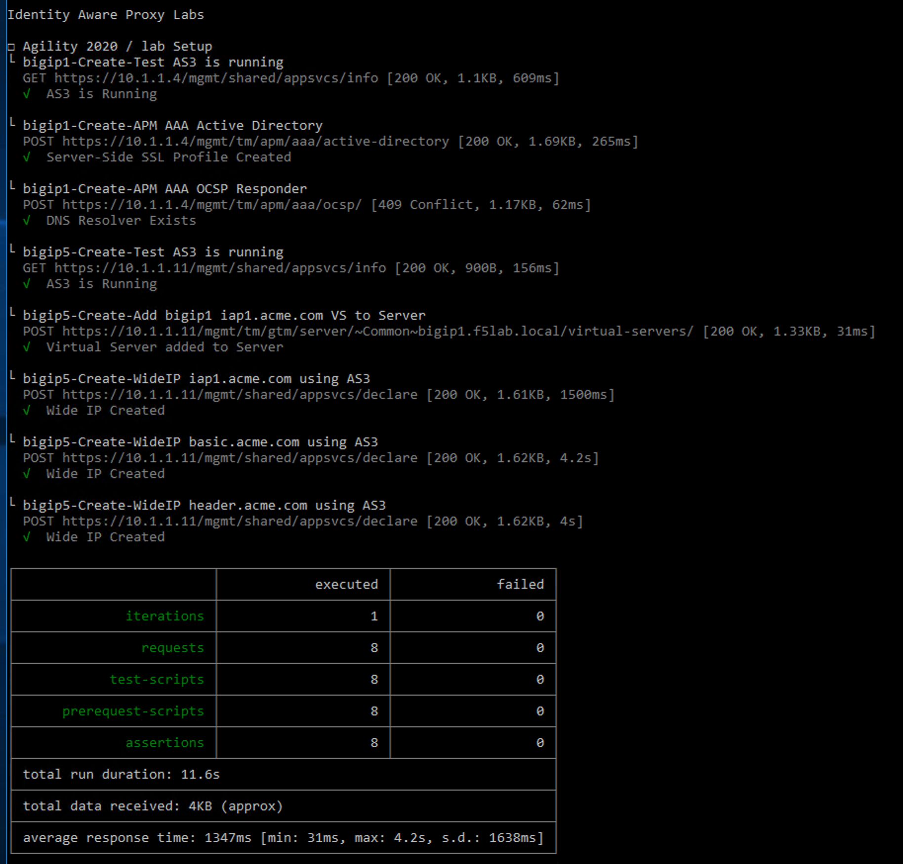

Lab 1.1 - Lab Environment Setup
----------------------------------------

Some steps of this lab will use preconfigured objects to permit more time on steps unqiue to this configuration rather than common BIG-IP tasks

Task - Run Postman collection using newman
~~~~~~~~~~~~~~~~~~~~~~~~~~~~~~~~~~~~~~~~~~~~~~~~~~~~~~~~

#. Click the **Command Prompt** shortcut to open the command prompt on the jumphost 
|image042|
#. Type the command **cd:\\labfiles\\solutions\\postman** to navigate the Postman collection folder.
|image043|
#. Type the command **newman run "Identity Aware Proxy Labs.json" -e lab-setup.json -k**
|image044|
#. All Steps in the collection should succeed before moving on to the lab.  If an API call fails run the collection again by repeating the previous step.  
|image045|

.. |image0| image:: media/image042.png
.. |image0| image:: media/image043.png
.. |image0| image:: media/image044.png

